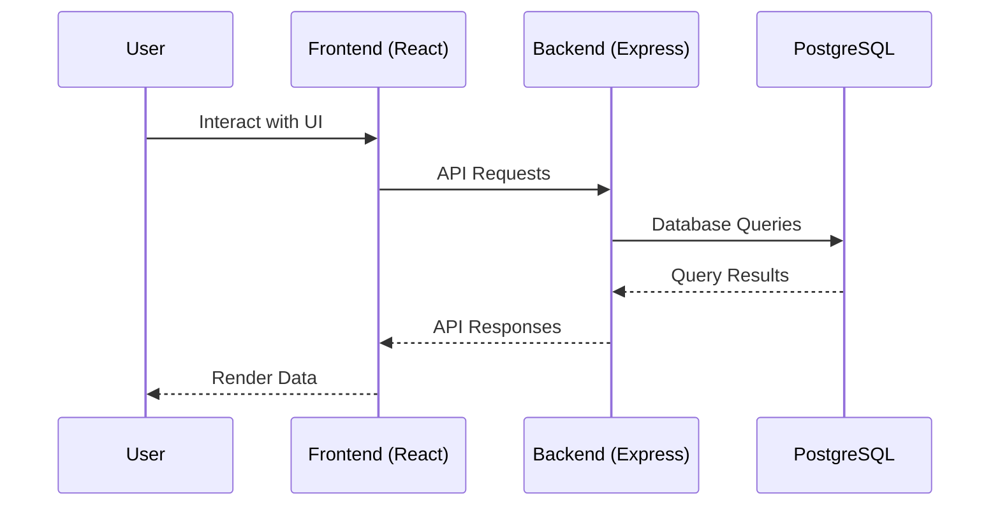

# Reality Dashboard

A task management and analytics application built with React and Node.js.

## Architecture

The application follows a client-server architecture with a React frontend and a Node.js backend.

### System Diagram



### Backend Architecture

- Express.js server handling REST API endpoints
- PostgreSQL database for data persistence
- JWT authentication for user sessions
- Password hashing with bcrypt

### Frontend Architecture

- React application built with Vite
- Tailwind CSS for styling
- Axios for API communication
- Context API for state management

## UI Layout

The application features a dashboard interface with sidebar navigation.

### Main Layout

```
+-------------------+-------------------+
|                   |                   |
|     Sidebar       |    Main Content   |
|                   |                   |
| - Dashboard       | +-----------------+
| - Tasks           | |   Hero Card     |
| - Analytics       | +-----------------+
| - Settings        |                   |
|                   | +-----------------+
|                   | |   Task List     |
|                   | +-----------------+
+-------------------+-------------------+
```

### Component Structure

```
App
├── Sidebar
├── Dashboard
│   ├── HeroCard
│   ├── TaskList
│   ├── Analytics
│   │   ├── MetricCard
│   │   └── ChartSection
│   └── AddTaskForm
├── Login
├── Signup
└── Settings
```

## Installation

### Prerequisites

- Node.js (version 16 or higher)
- PostgreSQL database

### Backend Setup

1. Navigate to the backend directory:
   ```
   cd backend
   ```

2. Install dependencies:
   ```
   npm install
   ```

3. Create a `.env` file with the following variables:
   ```
   DATABASE_URL=your_postgresql_connection_string
   JWT_SECRET=your_jwt_secret
   PORT=5000
   ```

4. Start the server:
   ```
   npm start
   ```

### Frontend Setup

1. Navigate to the frontend directory:
   ```
   cd frontend/reality-dashboard-frontend
   ```

2. Install dependencies:
   ```
   npm install
   ```

3. Create a `.env` file with the API base URL:
   ```
   VITE_API_BASE_URL=http://localhost:5000
   ```

4. Start the development server:
   ```
   npm run dev
   ```

## Usage

1. Register a new account or log in with existing credentials.
2. Add tasks using the task form.
3. View and manage tasks in the task list.
4. Monitor progress through the analytics dashboard.
5. Adjust settings as needed.

## API Endpoints

- `POST /auth/signup` - User registration
- `POST /auth/login` - User login
- `GET /tasks` - Fetch user tasks
- `POST /tasks` - Create new task
- `PUT /tasks/:id` - Update task
- `DELETE /tasks/:id` - Delete task
- `PUT /user/update` - Update user profile
- `PUT /user/change-password` - Change password

## Development

### Running Tests

Backend tests:
```
cd backend
npm test
```

Frontend linting:
```
cd frontend/reality-dashboard-frontend
npm run lint
```

### Building for Production

Frontend build:
```
cd frontend/reality-dashboard-frontend
npm run build
```

## Contributing

1. Fork the repository
2. Create a feature branch
3. Make your changes
4. Submit a pull request

## License

This project is licensed under the MIT License.